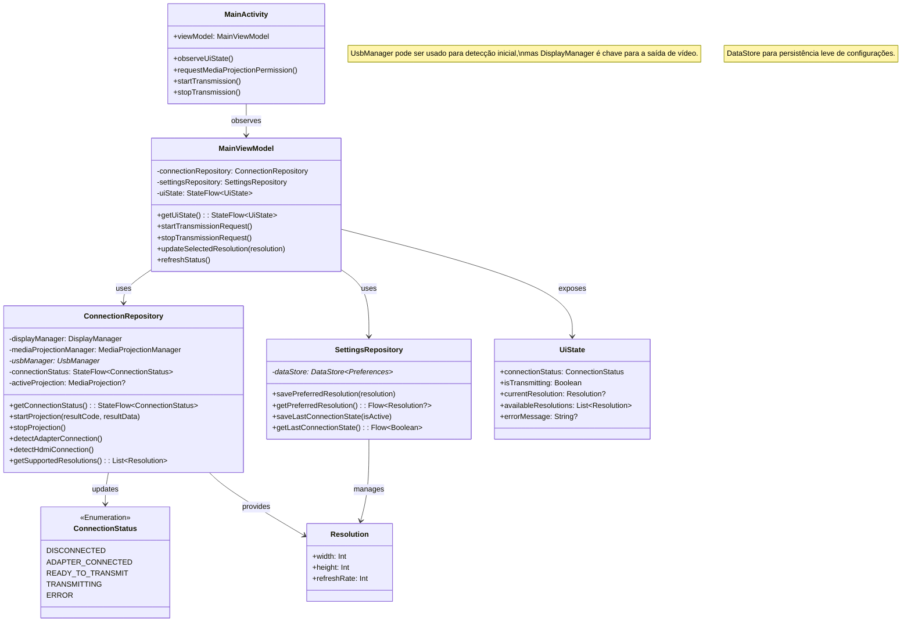
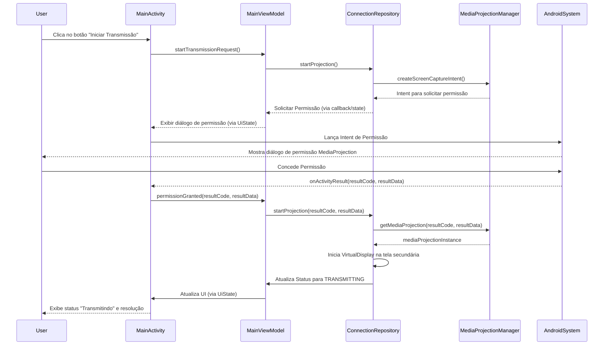

# Modelagem UML: USB2HDMI Android App

Este documento contém os diagramas UML essenciais que descrevem a estrutura e o comportamento do aplicativo USB2HDMI, baseados nos requisitos definidos em `REQUISITOS.md`. A sintaxe utilizada é a do Mermaid JS.

## 1. Diagrama de Casos de Uso

Este diagrama ilustra as principais interações entre o ator (Usuário) e o sistema (Aplicativo USB2HDMI).

```mermaid
graph TD
    A[Usuário] --> UC1(Visualizar Status da Conexão);
    A --> UC2(Iniciar Transmissão);
    A --> UC3(Parar Transmissão);
    A --> UC4(Selecionar Resolução);
    A --> UC5(Verificar Diagnósticos/Logs);

    UC2 --> P1(Solicitar Permissão MediaProjection) : include;
    UC4 --> P2(Verificar Resoluções Suportadas) : include;

    subgraph Sistema USB2HDMI App
        UC1;
        UC2;
        UC3;
        UC4;
        UC5;
        P1;
        P2;
    end

    style A fill:#f9f,stroke:#333,stroke-width:2px
```

**Descrição dos Casos de Uso:**

*   **UC1: Visualizar Status da Conexão:** O usuário pode ver o estado atual da conexão (Desconectado, Adaptador Conectado, Pronto para Transmitir, Transmitindo, Erro) - Relacionado a RF005.
*   **UC2: Iniciar Transmissão:** O usuário pode iniciar o espelhamento/extensão da tela para o monitor HDMI - Relacionado a RF006.
    *   **P1: Solicitar Permissão MediaProjection:** O sistema solicita a permissão necessária antes da primeira transmissão - Relacionado a RF008.
*   **UC3: Parar Transmissão:** O usuário pode interromper a transmissão ativa - Relacionado a RF007.
*   **UC4: Selecionar Resolução:** O usuário pode escolher uma resolução de saída diferente (se disponível) - Relacionado a RF010.
    *   **P2: Verificar Resoluções Suportadas:** O sistema verifica as resoluções compatíveis com o monitor/adaptador.
*   **UC5: Verificar Diagnósticos/Logs:** O usuário (ou desenvolvedor) pode acessar informações de log para diagnóstico - Relacionado a RF012.

---

## 2. Diagrama de Classes (Inicial)

Este diagrama esboça as classes principais da arquitetura (MVVM proposta) e seus relacionamentos.



**Descrição das Classes Principais:**

*   **MainActivity:** Responsável pela UI, observa o ViewModel e delega ações do usuário.
*   **MainViewModel:** Contém a lógica de apresentação, gerencia o estado da UI (`UiState`) e interage com os Repositórios.
*   **ConnectionRepository:** Encapsula a lógica de detecção de conexão (adaptador, HDMI), gerenciamento da `MediaProjection` e interação com as APIs do Android (`DisplayManager`, `MediaProjectionManager`, `UsbManager` - se necessário). Expõe o status da conexão.
*   **SettingsRepository:** Gerencia a persistência de configurações do usuário (ex: resolução preferida, último estado) usando DataStore ou SharedPreferences.
*   **UiState:** Classe de dados (ou sealed class) que representa o estado completo da UI a ser observado pela Activity/Fragment.
*   **ConnectionStatus:** Enumeração representando os possíveis estados da conexão (RF005).
*   **Resolution:** Classe de dados para representar uma resolução de tela.

---

## 3. Diagrama de Sequência: Iniciar Transmissão

Este diagrama ilustra o fluxo de interação quando o usuário solicita o início da transmissão.



**Descrição do Fluxo:**

1.  O Usuário clica para iniciar a transmissão.
2.  A `MainActivity` notifica o `MainViewModel`.
3.  O `MainViewModel` solicita ao `ConnectionRepository` para iniciar a projeção.
4.  O `ConnectionRepository` obtém o `Intent` para a permissão `MediaProjection`.
5.  A `MainActivity` exibe o diálogo de permissão do sistema.
6.  O Usuário concede a permissão.
7.  A `MainActivity` recebe o resultado e informa o `MainViewModel`.
8.  O `MainViewModel` repassa o resultado ao `ConnectionRepository`.
9.  O `ConnectionRepository` obtém a instância de `MediaProjection`.
10. O `ConnectionRepository` configura e inicia o `VirtualDisplay` para direcionar o conteúdo para a tela externa (detectada pelo `DisplayManager`).
11. O status é atualizado para `TRANSMITTING` e a UI é notificada.

---

Esta modelagem inicial fornece uma base sólida para a arquitetura e o fluxo do aplicativo. A próxima etapa seria a prototipagem da interface do usuário.